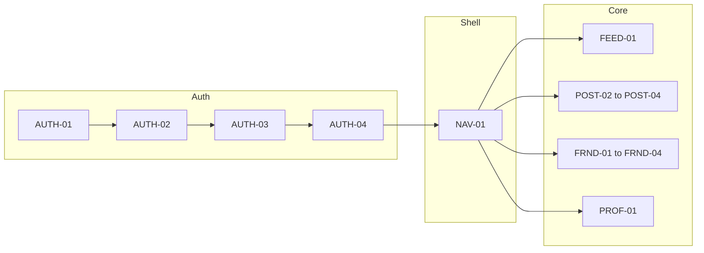

# MVP screens

Scoped set for **first shippable Nomi**: verified identity, phone-based friend graph, **feed + posts (up to 5 photos + caption)**, **poster-only reactions**, block + report, minimal profile and settings. Aligns with implementation [Phase 1 and Phase 2](../../implementation/phases.md). Full catalog (including post-MVP): [inventory](inventory.md).

**Assumption**: one **phone + OTP** path serves both new and returning users unless you split **AUTH-05** later.

---

## MVP shell

| ID       | Screen    | MVP notes                                                                                                                            |
| -------- | --------- | ------------------------------------------------------------------------------------------------------------------------------------ |
| `NAV-01` | App shell | Tabs or root stack after sign-in: at minimum **Feed**, entry to **Add friend**, **Create post**, **Profile** (exact tab labels TBD). |

Modals/sheets (**NAV-02**) implement report, block confirm, reaction picker—design as overlays; same IDs as in [inventory](inventory.md).

---

## Authentication (cold start + return visit)

| ID        | Screen               | MVP notes                                       |
| --------- | -------------------- | ----------------------------------------------- |
| `AUTH-01` | Welcome              | First launch only; single path into phone flow. |
| `AUTH-02` | Phone entry          | Country + number; validation errors.            |
| `AUTH-03` | OTP / verify code    | Wrong code, resend cooldown, help for no SMS.   |
| `AUTH-04` | Verification success | Lands user in app shell (`NAV-01`).             |

**Defer post-MVP**: `AUTH-06` (dedicated re-auth screen)—handle v1 with generic error + retry or inline re-verify later.

---

## Friends

| ID        | Screen                    | MVP notes                                                                     |
| --------- | ------------------------- | ----------------------------------------------------------------------------- |
| `FRND-01` | Add friend — phone entry  | Core discovery flow.                                                          |
| `FRND-02` | Lookup result — found     | Preview + send request; states: already friends / pending.                    |
| `FRND-03` | Lookup result — not found | Copy only; no invite flow required for MVP unless you add it.                 |
| `FRND-04` | Incoming requests list    | Accept/decline incoming; empty state.                                         |
| `FRND-07` | Friends list              | See connections; entry point to **friend profile** and optional remove/block. |

**MVP simplification**: implement **accept/decline inline** on `FRND-04` and skip `**FRND-05`** (detail) unless you need a detail layout for block—if so, keep `FRND-05` as optional.

**Defer post-MVP**: `FRND-06` (outgoing-only list).

---

## Feed, reactions, post detail

| ID        | Screen                         | MVP notes                                                                                                              |
| --------- | ------------------------------ | ---------------------------------------------------------------------------------------------------------------------- |
| `FEED-01` | Home feed                      | Friends’ posts; loading + empty (no friends / no posts).                                                               |
| `FEED-02` | Post detail                    | Recommended for **5-photo** carousel + caption; can be deferred only if feed cards expand in-place with full carousel. |
| `FEED-03` | Post — friend reaction         | React without seeing others’ reactions; self-state only.                                                               |
| `FEED-04` | Post — author reaction summary | Poster-only list/summary of reactions.                                                                                 |

`FEED-03` / `FEED-04` are often **modes** on the feed card or post detail, not separate routes.

---

## Create post

| ID        | Screen           | MVP notes                        |
| --------- | ---------------- | -------------------------------- |
| `POST-01` | Composer entry   | Big CTA or tab—entry to picker.  |
| `POST-02` | Pick media       | Up to 5 photos; reorder; remove. |
| `POST-03` | Caption          | Text + preview of selection.     |
| `POST-04` | Review / publish | Publish + upload failure.        |

**Defer as separate frame**: `POST-05`—use **toast or navigate to feed** instead of a dedicated success screen.

---

## Profile

| ID        | Screen         | MVP notes                                                               |
| --------- | -------------- | ----------------------------------------------------------------------- |
| `PROF-01` | My profile     | Me + link to settings; optional “my posts” stub or grid later.          |
| `PROF-02` | Friend profile | Minimal info; paths to block, remove friend (if in scope), report user. |

**Defer post-MVP**: `PROF-03` (edit profile)—unless MVP requires display name/avatar; then add a single **edit** sheet or screen.

---

## Safety

| ID        | Screen             | MVP notes                               |
| --------- | ------------------ | --------------------------------------- |
| `SAFE-01` | Report post        | Reason + submit + success.              |
| `SAFE-02` | Report user        | Same pattern from profile or post menu. |
| `SAFE-03` | Block confirmation | From friend profile or post menu.       |
| `SAFE-04` | Blocked users list | Unblock; empty state.                   |

---

## Settings (minimal)

| ID       | Screen           | MVP notes                                                                 |
| -------- | ---------------- | ------------------------------------------------------------------------- |
| `SET-01` | Settings root    | Account, blocked, sign out; hide notification toggles if push not in MVP. |
| `SET-04` | Sign out confirm | Yes.                                                                      |

**SET-02 (account / phone)**: include **view verified number** for MVP; **change number** can be a follow-on if engineering scope is tight—otherwise one combined account screen with “Change” opening the same OTP pattern as auth.

**Defer post-MVP**: `SET-03` notifications until push exists; slim `SET-01` if so.

---

## System

| ID       | Screen               | MVP notes                 |
| -------- | -------------------- | ------------------------- |
| `SYS-01` | Generic error        | Retry where applicable.   |
| `SYS-02` | Offline / no network | Feed and actions blocked. |

**Defer**: `SYS-03` maintenance.

---

## MVP frame checklist (design)

Use this for Stitch/Figma scope control:

- `NAV-01`
- `AUTH-01`–`AUTH-04`
- `FRND-01`–`FRND-04`, `FRND-07` (+ `FRND-05` if not inline-only)
- `FEED-01`–`FEED-04` (or merged variants on `FEED-01`/`FEED-02`)
- `FEED-02` if separate from feed cards
- `POST-01`–`POST-04`
- `PROF-01`–`PROF-02`
- `SAFE-01`–`SAFE-04`
- `SET-01`, `SET-04` (+ `SET-02` if account in MVP)
- `SYS-01`–`SYS-02`

---

## MVP flow (high level)

---

## Deferred (still in [inventory](inventory.md))

| IDs                  | When                             |
| -------------------- | -------------------------------- |
| `AUTH-05`, `AUTH-06` | Separate login/re-auth UX        |
| `FRND-05`, `FRND-06` | Request detail / outgoing list   |
| `POST-05`            | Dedicated publish success screen |
| `PROF-03`            | Edit profile                     |
| `SET-03`             | Notification settings            |
| `SYS-03`             | Maintenance                      |

